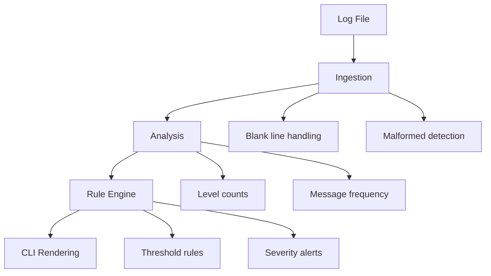

# PyLog — Log Analysis Tool

Lightweight Python CLI tool for parsing structured logs, detecting anomalies, and generating rule-based reports using a modular pipeline architecture.

---

# TL;DR

PyLog is a fully tested Python log analysis pipeline featuring:

- ingestion and validation
- structured analysis of log levels and message frequency
- rule-based alerting system
- CLI rendering with export support
- modular architecture with pytest coverage

---

# Why this project matters

This project demonstrates:

- layered system design (ingestion → analysis → rules → rendering)
- real-world error handling (blank and malformed input handling)
- test-driven development with full pytest coverage
- CLI tool design with structured and deterministic output
- separation of concerns in a modular Python package

---

# Architecture



---

# Features
## Ingestion Layer

Parses structured log files and ensures robust handling of invalid input.

- Reads log files line by line
- Handles blank lines safely
- Detects malformed lines
- Detects unknown log levels
- Tracks ingestion statistics including:
    - total lines
    - valid lines
    - skipped categories

## Analysis Layer

Processes valid log entries into structured statistics.

- Counts log levels:
    - INFO
    - WARNING
    - ERROR
- Extracts and aggregates message frequency
- Produces deterministic analysis output

## Rule Engine

Evaluates log data against configurable thresholds.

- Detects failed login spikes
- Detects repeated error patterns
- Applies threshold-based rules
- Generates severity-based alerts:
    - HIGH
    - MEDIUM
    - LOW

## CLI Output Layer

Generates structured terminal output.

- Human-readable report formatting
- Displays:
    - file metadata
    - ingestion summary
    - log level breakdown
    - top messages
    - alerts
- Supports:
    - verbose mode
    - compact mode
    - export flags

---

# Testing Strategy

PyLog includes a full pytest suite covering:

- ingestion correctness (including edge cases)
- analysis validation
- rule engine behavior
- rendering structure validation
- full pipeline integration test

Key properties:

- deterministic output
- reproducible behavior
- full edge-case coverage
- automated validation across layers

---

# Usage
```bash
python -m pylog.cli sample.log
```

Example Input
```text
2026-06-12 INFO Login successful
2026-06-12 ERROR Failed login
2026-06-12 WARNING Low disk space
```

<details>
<summary>Expand full output</summary>

```text
====================================
PyLog Analysis Report

Mode: default | verbose
====================================

File: input.log

3 lines processed
3 valid lines
0 alert(s) | threshold = 3

Log Summary
------------------------------------
ERROR                1
WARNING              1
INFO                 1

Message Frequency
------------------------------------
Login successful     1
Failed login         1
Low disk space       1

Alerts
------------------------------------
No alerts detected

Ingestion Summary
------------------------------------
Ingestion: 3 lines (100% clean, 0 skipped)
```
</details>

---

# Design Decisions
## Separation of Concerns

Each layer has a single responsibility:

- ingestion → parsing and validation
- analysis → aggregation
- rules → detection
- rendering → formatting

## Deterministic Pipeline

All outputs are:

- testable
- reproducible
- structured

---

# Tech Stack

- Python 3.10+
- pytest
- CLI (argparse-style execution)
- modular package structure

---

# Status

PyLog v1.1.1 — Stable Release

- ingestion robustness fixed (blank and malformed lines)
- CLI stabilized
- full test suite passing
- modular package structure complete

---

# Future Improvements

- streaming log ingestion
- config-driven rule engine
- JSON and CSV export expansion
- plugin-based rule system
- performance optimization for large logs

---

# What this project demonstrates

- layered system architecture
- deterministic data pipelines
- test-driven development
- CLI tool design
- modular Python packaging

---

# Motivation

This project was built to simulate a production-style log processing pipeline with strict separation between ingestion, analysis, rule evaluation, and rendering. The goal was to focus on correctness, testability, and predictable CLI behavior rather than relying on external logging frameworks.


