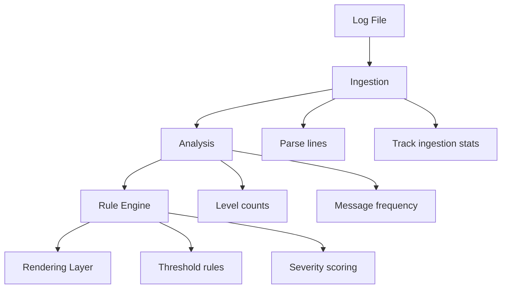

# PyLog — Log Analysis Tool

---

## TL;DR

PyLog is a Python CLI tool that analyzes log files using a structured pipeline (ingestion → analysis → rules → rendering) with full pytest coverage and deterministic output.

---

PyLog is a lightweight Python-based log analysis tool designed to parse structured log files, classify log levels, detect anomalies, and generate readable CLI summaries with rule-based alerting.

It is built as a modular system with clear separation between ingestion, analysis, rule evaluation, and rendering.

---

# Key Features

## Log Ingestion
- Parses structured log files line by line
- Detects:
  - malformed lines
  - blank lines
  - unknown log levels
- Tracks ingestion statistics


## Log Analysis
- Counts log levels:
  - INFO
  - WARNING
  - ERROR
- Extracts most frequent messages
- Maintains structured analysis output


## Rule-Based Alert System
- Detects patterns such as:
  - failed login spikes
  - error volume thresholds
  - repeated messages
- Generates severity-based alerts:
  - HIGH
  - MEDIUM
  - LOW


## CLI Rendering
- Human-readable CLI output
- Structured sections:
  - File header
  - Log level summary
  - Top messages
  - Alert blocks
- Supports verbose and compact modes

## CLI Flags

### Required behavior
- --threshold
- --level
- --top

### Output controls
- --verbose
- --export
- --csv_export
- --json

---

# Architecture Overview

The system processes logs through a strict linear pipeline:



---

# Testing Strategy

The project includes a comprehensive pytest suite organized into:

## Rule Engine Tests
- Validates alert triggering logic

## Ingestion Tests
- Validates parsing correctness
- Ensures blank/malformed detection
- Verifies ingestion invariants

## Analysis Tests
- Validates log level counting
- Message frequency tracking

## Edge Case Tests
- Handles malformed-only logs
- Ensures system stability under noisy input

## Rendering Tests
- Validates CLI output structure
- Ensures correct formatting of:
  - headers
  - log summaries
  - alert blocks

## Integration Test
- End-to-end pipeline validation:
  - ingestion → analysis → rules → rendering

---

# Usage

```bash
python pylog.py sample.log
```

## Example Input
```text
2026-06-12 INFO Login successful
2026-06-12 ERROR Failed login
2026-06-12 WARNING Low disk space
```

## Full CLI Output

<details>
<summary>Expand full output</summary>

```text
====================================
PyLog Analysis Report

Mode: default | verbose
====================================

File: input.log

3 lines processed
3 valid lines
0 alert(s) | threshold = 3

Log Summary
------------------------------------
ERROR                1
WARNING              1
INFO                 1

Message Frequency
------------------------------------
Login successful     1
Failed login         1
Low disk space       1

Alerts
------------------------------------
No alerts detected

Ingestion Summary
------------------------------------
Ingestion: 3 lines (100% clean, 0 skipped)
```

</details>


## Testing

All core functionality is validated through pytest, including ingestion edge cases, rule evaluation, and full pipeline integration.

Run the full test suite: 

```bash
pytest
```

---

# Design Decisions

## Separation of Concerns
Each layer has a single responsibility:
- ingestion → parsing
- analysis → aggregation
- rules → detection
- rendering → formatting


## Deterministic Output
All outputs are:
- testable
- reproducible
- structured


## Test-Driven Development
Core functionality is fully validated using pytest before release.


## Design Tradeoffs

- Chose a layered architecture to enforce separation of concerns over a monolithic parser design.
- Prioritized deterministic outputs to enable reliable testing.
- Opted for structured CLI output over flexible formatting for simplicity and stability.

---

# Future Improvements

- config file support (thresholds, filters)
- JSON log ingestion support
- streaming log processing for large files
- CLI argument interface (argparse)
- richer alert rule system

---

# What this project demonstrates

- Building a modular, test-driven data processing pipeline
- Designing CLI tools with predictable structured output
- Writing robust tests for ingestion, logic, and rendering layers

---

# Motivation

This project was built to simulate a production-style log processing pipeline with strict separation between ingestion, analysis, rule evaluation, and rendering. The goal was to focus on correctness, testability, and predictable CLI behavior rather than relying on external logging frameworks.

---


# Status

- v1.0 - Stable core release
- v1.1 - (current version) Modular package structure 

