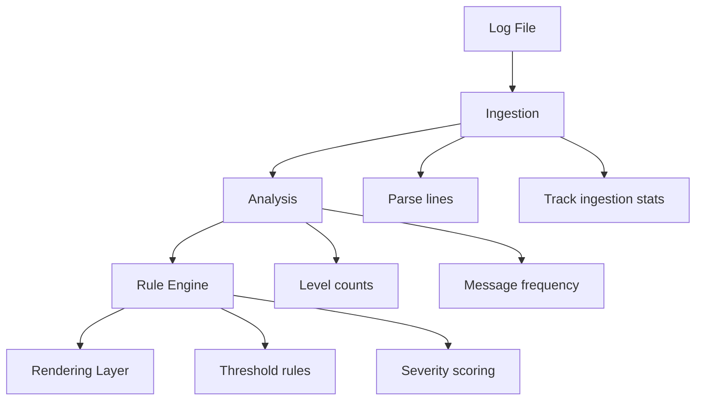

# PyLog — Log Analysis Tool

PyLog is a lightweight Python-based log analysis tool designed to parse structured log files, classify log levels, detect anomalies, and generate readable CLI summaries with rule-based alerting.

It is built as a modular system with clear separation between ingestion, analysis, rule evaluation, and rendering.

---

# Key Features

## Log Ingestion
- Parses structured log files line by line
- Detects:
  - malformed lines
  - blank lines
  - unknown log levels
- Tracks ingestion statistics

---

## Log Analysis
- Counts log levels:
  - INFO
  - WARNING
  - ERROR
- Extracts most frequent messages
- Maintains structured analysis output

---

## Rule-Based Alert System
- Detects patterns such as:
  - failed login spikes
  - error volume thresholds
  - repeated messages
- Generates severity-based alerts:
  - HIGH
  - MEDIUM
  - LOW

---

## CLI Rendering
- Human-readable CLI output
- Structured sections:
  - File header
  - Log level summary
  - Top messages
  - Alert blocks
- Supports verbose and compact modes

---

# Architecture Overview

PyLog is designed as a layered pipeline:



---

# Testing Strategy

The project includes a comprehensive pytest suite organized into:

## Rule Engine Tests
- Validates alert triggering logic

## Ingestion Tests
- Validates parsing correctness
- Ensures blank/malformed detection
- Verifies ingestion invariants

## Analysis Tests
- Validates log level counting
- Message frequency tracking

## Edge Case Tests
- Handles malformed-only logs
- Ensures system stability under noisy input

## Rendering Tests
- Validates CLI output structure
- Ensures correct formatting of:
  - headers
  - log summaries
  - alert blocks

## Integration Test
- End-to-end pipeline validation:
  - ingestion → analysis → rules → rendering

---

# Example Input
```text
2026-06-12 INFO Login successful
2026-06-12 ERROR Failed login
2026-06-12 WARNING Low disk space
```
---

# Example Output
```text
====================================
PyLog Analysis Report

Mode: default | verbose
====================================

File: input.log

3 lines processed
3 valid lines
0 alert(s) | threshold = 3

Log Summary
------------------------------------
ERROR                1
WARNING              1
INFO                 1

Message Frequency
------------------------------------
Login successful     1
Failed login         1
Low disk space       1

Alerts
------------------------------------
No alerts detected

Ingestion Summary
------------------------------------
Ingestion: 3 lines (100% clean, 0 skipped)
```
---

# Design Decisions

## Separation of Concerns
Each layer has a single responsibility:
- ingestion → parsing
- analysis → aggregation
- rules → detection
- rendering → formatting

---

## Deterministic Output
All outputs are:
- testable
- reproducible
- structured

---

## Test-Driven Development
Core functionality is fully validated using pytest before release.

---

# Future Improvements

- config file support (thresholds, filters)
- JSON log ingestion support
- streaming log processing for large files
- CLI argument interface (argparse)
- richer alert rule system

---

# What this project demonstrates

- modular system design
- test-driven development
- data pipeline architecture
- CLI tool design
- production-style test structuring

---

# Status

v1.0 — Stable core release

